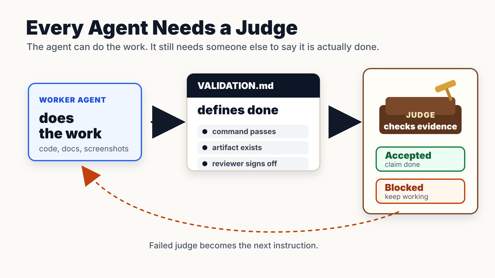

# validation-md

Make "done" checkable.

Agents can do a lot of work now. The weak point is acceptance: the agent says the
task is done before the evidence is strong enough. `VALIDATION.md` is a small
repo-local definition of done that humans and agents can both read.



Default behavior is manual:

```text
/validation run
```

Hook mode exists, but it is opt-in. Normal discussion should not be interrupted
by a validation gate.

## Quick Start

Create `VALIDATION.md` in the repo root:

````markdown
# VALIDATION.md

This task is done only when every judge below passes.

```validation
goal: Work is ready for review
judges:
  - id: local_tests_pass
    run: npm test

  - id: screenshot_exists
    exists: screenshots/final.png
```
````

Run it:

```bash
npx -y --package github:zhenthebuilder/validation-md validation-md run
```

If a judge fails, the task is not done yet. The failed judge becomes the next
thing for the agent to fix.

## Agent Support

This repo can be used from both Claude Code and Codex.

### Claude Code

Install from the repo:

```text
/plugin marketplace add zhenthebuilder/validation-md
/plugin install validation-md@validation-md
```

Use it explicitly:

```text
/validation create require tests and a final screenshot
/validation run
```

Hard-stop mode is optional. Turn it on only for tasks where the agent should be
blocked from claiming done until validation passes:

```text
/validation hook on
/validation hook off
/validation hook status
```

### Codex

Point Codex at this repo as a plugin and use:

```text
/validation run
```

Codex hook enforcement is not implemented here yet. For Codex, use explicit
validation runs.

## Why a File?

Permanent checks are usually written when the repo is set up. `VALIDATION.md` is
written when the task is scoped.

A UI change, a dependency upgrade, and a research report can each have a
different definition of done without rewriting permanent automation. The handoff
is the point:

- the agent can draft the validation file;
- the human can edit it;
- a command, plugin skill, hook, or automated check can enforce it.

If the acceptance criteria live in a file, they travel with the work instead of
getting buried in chat.

## Examples

Run commands:

```yaml
judges:
  - id: tests_pass
    run: npm test
```

Require artifacts:

```yaml
judges:
  - id: screenshot_exists
    exists: screenshots/final.png
```

Use validation for writing too:

```yaml
judges:
  - id: draft_has_human_voice
    run: validation-md lint-writing draft.md --max-contrastive 1
```

Use a separate reviewer agent behind a command:

```yaml
judges:
  - id: code_review
    run: ./scripts/review-agent.sh
```

The protocol should eventually make reviewer agents, code reviewers, and other
semantic judges easier to define directly. For now, any reviewer that can return
a process exit code can be used as a `run` judge.

See [`examples/`](examples/) for complete files and
[`docs/reference.md`](docs/reference.md) for the full file format, CLI, and
hook behavior.

## Status

This is an early exploration of a small protocol for agent validation. The useful
part is the convention: define completion in a file, run it explicitly, and turn
on hook mode only when a task needs a hard gate.

Longer term, teams should be able to publish and reuse judge packs: UI review,
code review, research review, writing voice, release readiness, and other
definitions of done.

Contributions are welcome. See [`CONTRIBUTING.md`](CONTRIBUTING.md).

## License

MIT
